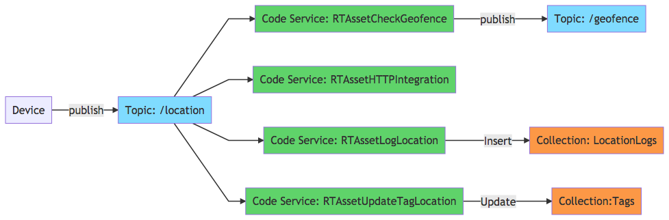

# Overview


The need for geospatial computation and spatial data interpretation is a recurring theme among Internet of Things projects.

This template is a fully functional and extensible asset tracking IoT solution.

# Usage



## Data Capture with MQTT

>1. `Device` connects to [MQTT Broker](https://docs.clearblade.com/v/3/1-platform_concepts/messaging/overview/)
>2. `Subscribe` to `/location` topic
>3. `Publish` a [Message](TODO URL TO MESSAGE) to to `/location` topic

`{	"id":"<TAG_ID>",	"lat":<LATITUDE>,	"long":"<LONGITUDE> } `


## Geofence Detection
>1. When a position is within a geofence, a response message is published on the `geofence` topic


`Point with ID: 2b is within geofence 1a8b`
## Portal

>1. Portals Tab > CJS_Portal


# Contents
### Portals
CJS_Portal

> 1. Interactive 3D Map of New York City's Manhattan  
> 2. Pie Chart of Anomalies Detected  
> 3. Bar Chart of Zone Activity  
> 4. Time-Series Multi-Line Graph of activity  
> 5. Message Logs  
> 6. Monitoring Enable Switch  
> 7. Edge Selection  

### Code Services
>1. messageToCollectionCreate - creates row in MessageHistory collection	 
>2. messageToCollectionUpdate - updates Tags collection with latest position
>3. messageToGeofenceCheck - checks if tag is within configured geofence
>4. messageToHTTPPost - Sends a configurable HTTP POST request
>5. RegularlyFetchAnchors - Fetch static geospatial reference data
>6. uploadPoints - Bulk upload of Tag positions

### Code Libraries
>1. constants  

### Mesaging Topics
>1. position - Things publish their position on this topic
>2. geofence - Geofence status is published here

### Collections
>1. MessageHistory - History of all MQTT Messages received 
>2. Tags - Latest position of all tags

### Triggers
>1. trigger_messageToCollectionCreate
>2. trigger_messageToCollectionUpdate
>3. trigger_messageToHTTPPost

# Development

## How to Update Graph

```
npm i
npm run buildGraph
```

# Credit

Icon by BomSymbols
